# Práctica Módulo 05 - Creando Soluciones de Calidad

Proyecto académico con el objetivo de utilizar una arquitectura en Google Cloud Platform que ponga de manifiesto las buenas prácticas del desarrollo Cloud y la metodologia de [*twelve-factor app*](https://12factor.net/es/), ([enunciado](./Enunciado-Practica_Creando_Soluciones_de_Calidad.pdf)).

## Instalación de requisitos

Se ha comprobado la ejecución correcta de los ejercicios en un sistema operativo [Debian 9](https://www.debian.org/index.es.html), con las siguientes aplicaciones previamente instaladas:

* [Google Cloud SDK](https://cloud.google.com/sdk/install) 264.0.0.
  * alpha 2019.09.22.
  * beta 2019.0.22.
  * bq 2.0.47.
  * core 2019.09.22.
  * gsutil 4.42.
  * kubectl 2019.09.22.
* [Docker](https://docs.docker.com/install/linux/docker-ce/debian/) 19.03.2, build 6a30dfca03.
* [Docker Compose](https://docs.docker.com/compose/install/) 1.24.1, build 4667896b.
* [Git](https://www.git-scm.com/) 2.11.0.

Instalar "*Google Cloud SDK*":

```bash
export CLOUD_SDK_REPO="cloud-sdk-$(lsb_release -c -s)"
echo "deb http://packages.cloud.google.com/apt $CLOUD_SDK_REPO main" | sudo tee -a /etc/apt/sources.list.d/google-cloud-sdk.list
curl https://packages.cloud.google.com/apt/doc/apt-key.gpg | sudo apt-key add -
sudo apt-get update && sudo apt-get install google-cloud-sdk -y
```

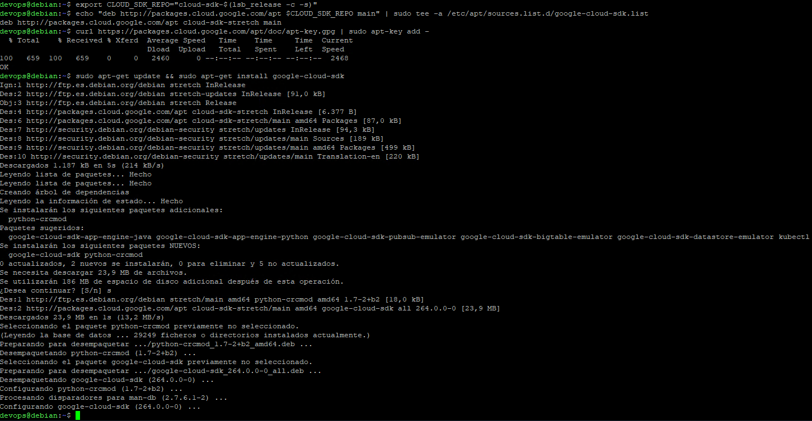

Inicializar el SKD "*Google Cloud SDK*":

```bash
gcloud init
```

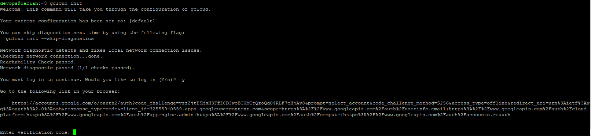

Hacer login con la guenta de Google:


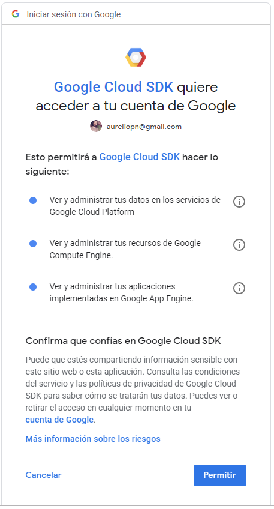

Copiar el código obtenido en la consola:

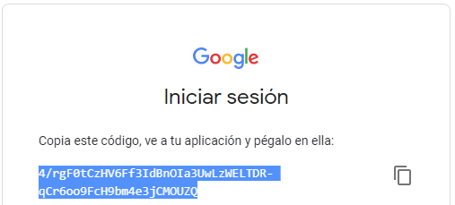

Seleccionar el proyecto "*practica-kc-05-calidad*":

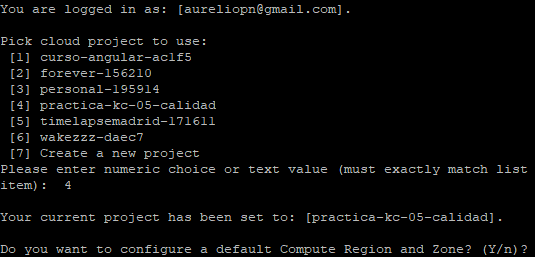

Escoger como region por defecto la *17* ("*europe-west1-b*"):

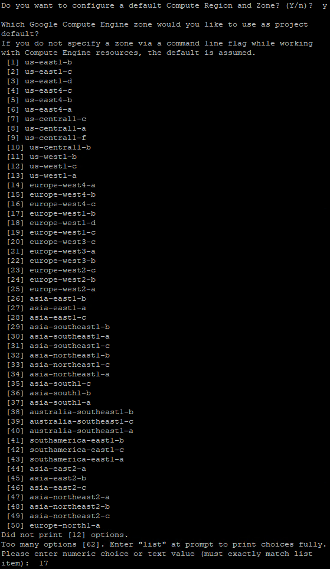

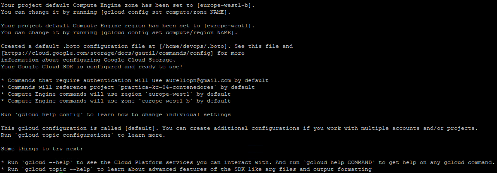

Comprobar la instalación del SKD "*Google Cloud SDK*":

```bash
gcloud --version
```

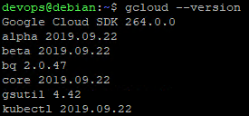

Instalar *[kubectl](https://kubernetes.io/es/docs/tasks/tools/install-kubectl/)*:

```bash
sudo apt-get install kubectl -y
```

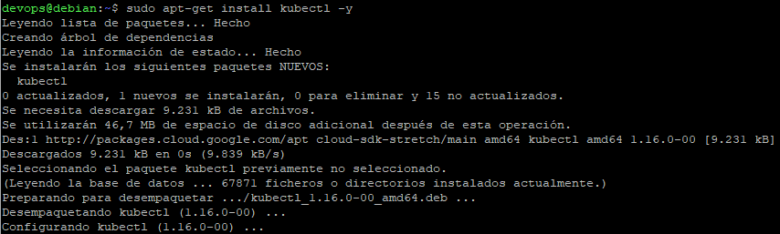

Instalar "*Git*":

```bash
sudo apt-get install git -y
```

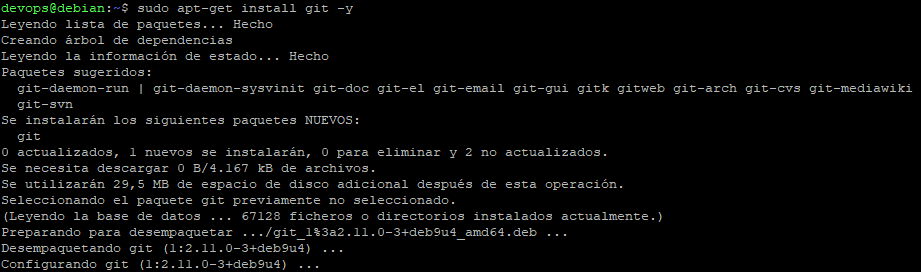

Dar acceso completo al proyecto "*practica-kc-05-calidad*" al usuario "​christianhxc@gmail.com", con rol "*editor*":

```bash
gcloud projects add-iam-policy-binding practica-kc-05-calidad --member user:christianhxc@gmail.com --role roles/editor
```

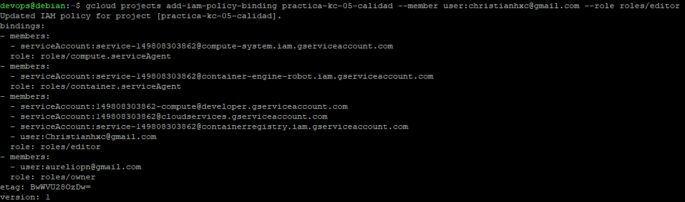

## Crear clúster en GKE e instalar la práctica

Clonar este repositorio en el directorio "*practica*":

```bash
mkdir practica
cd practica
git clone https://gitlab.keepcoding.io/URE/calidad.git
cd ..
```

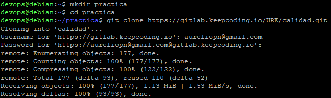

Ejecutar el script [crear_cluster_practica.sh](./01-practica/crear_cluster_practica.sh) que crea el clúster con la práctica instalada:

```bash
cd practica/calidad/01-practica
sudo chmod 700 *.sh
./crear_cluster_practica.sh >> log.txt
cd ../../..
```

En caso de encontrar algún problema, se puede estudiar la salida generada en el archivo [log.txt](./01-practica/log.txt).

## Puntos relativos a la práctica

### Código fuente en GitHub

El repositorio de la aplicación utilizada en la práctica está en [GitHub](https://github.com/UREURE/netcore-counter.git).

### Sistema con más de dos microservicios

Se han utilizado cuatro microservicios en el ejemplo de la práctica (tres de *netcore-counter*, y uno de Redis):


### Comunicacion entre servicios (HTTP, RPC, o Colas)

La comunicación entre los microservicios es HTTP a través del Web API que ofrecen.

### *Manifest files* de Kubernetes

Los *manifest files* de la aplicación *netcore-counter* están en el directorio [k8s](https://github.com/UREURE/netcore-counter/tree/master/k8s/) del repositorio de la aplicación. Se recomienda utilizar el script [start-kubernetes.sh](https://github.com/UREURE/netcore-counter/blob/master/k8s/start-kubernetes.sh) de instalación, que recibe los parámetros:

* 1: Contraseña para Redis.
* 2: *Namespace* en el que instalar la aplicación.

### Interfaz web API

La documentación de la interfaz Web API de la aplicación *netcore-counter* se expone en la dirección *http://**host**:**puerto**/api/v1/swagger/index.html*.


### Instrucciones de ejecución y uso de la aplicación (comando y URL de prueba)

Las instrucciones de uso la aplicación están documentadas en el archivo [README.md](https://github.com/UREURE/netcore-counter.git) del repositorio de código fuente, y en la URL:

* [http://netcore-counter-user.35.195.3.143.nip.io/api/v1/swagger/index.html](http://netcore-counter-user.35.195.3.143.nip.io/api/v1/swagger/index.html).

### Uso de variables de entorno

La aplicación utiliza el archivo de configuración [appsettings.json](https://github.com/UREURE/netcore-counter/blob/master/solution/src/Counter.Web/appsettings.json), cuyos valores pueden ser sobreescritos por las variables del entorno en el que se ejecuta. Un ejemplo de modificación de las variables del archivo de configuración, utilizando las variables de entorno, se puede observar en el archivo [05_counter-deployment-user.yaml](https://github.com/UREURE/netcore-counter/blob/master/k8s/05_counter-deployment-user.yaml).

### Uso de *feature flags*

Los microservicios basados en la imagen *netcore-counter* tienen la *feature flag* "**PERSISTENCIANEXTCOUNTER**" con los siguientes valores:

* Microservicio 1 (netcore-counter-user): **true** (consume el microservicio 2).
* Microservicio 2 (netcore-counter-next): **true** (consume el microservicio 3).
* Microservicio 3 (netcore-counter-redis): **false** (consume Redis).

Se puede cambiar el valor de la *feature flag* del "**Microservicio 1**" a través de los métodos expuestos por el controlador "*Feature*" en el [servicio](http://netcore-counter-user.35.195.3.143.nip.io/api/v1/swagger/index.html) Web API.

El uso en el código fuente de la *feature flag* está en el controlador [CounterController](https://github.com/UREURE/netcore-counter/blob/master/solution/src/Counter.Web/Controllers/CounterController.cs):

```C#
        protected ICounterRepository GetRepository()
        {
            if (configuracion != null && configuracion.IsFeaturePersistenciaNextCounterEnabled)
                return repositoryFactory.Get(Claves.SELECTOR_PERSISTENCIA_NEXT_COUNTER);
            else
                return repositoryFactory.Get(Claves.SELECTOR_PERSISTENCIA_REDIS);
        }
```

### Cada microservicio puede utilizar su propia base de datos

Cada instancia de *netcore-counter* se puede configurar para que utilice diferentes sistemas de persistencia: otro servicio *netcore-counter*, una base de datos Redis, o cualquier implementación futura de la interfaz [ICounterRepository](https://github.com/UREURE/netcore-counter/blob/master/solution/src/Counter.Web/Repository/ICounterRepository.cs).

### Cada microservicio puede consultar la base de datos de otro servicio indirectamente como un API

Si la *feature flag* "**PERSISTENCIANEXTCOUNTER**" tiene valor "**true**", se consume la base de datos de otro servicio *netcore-counter*, a través del Web API que expone.

### Emisión de *logs*, trazas y métricas

Los *logs* y las trazas de los microservicios de *netcore-counter* son accesibles desde:

* Microservicio 1 (netcore-counter-user): [Stackdriver logs](https://console.cloud.google.com/logs/viewer?interval=NO_LIMIT&project=practica-kc-05-calidad-256807&minLogLevel=0&expandAll=false&timestamp=2019-10-24T11:18:28.364000000Z&customFacets=&limitCustomFacetWidth=true&advancedFilter=resource.type%3D%22k8s_container%22%0Aresource.labels.project_id%3D%22practica-kc-05-calidad-256807%22%0Aresource.labels.location%3D%22europe-west1-b%22%0Aresource.labels.cluster_name%3D%22practica-calidad%22%0Aresource.labels.namespace_name%3D%22practica-netcore-counter%22%0Alabels.k8s-pod%2Frun%3D%22netcore-counter-user%22&scrollTimestamp=2019-10-24T11:18:06.867313115Z).
* Microservicio 2 (netcore-counter-next): [Stackdriver logs](https://console.cloud.google.com/logs/viewer?advancedFilter=resource.type%3D%22k8s_container%22%0Aresource.labels.project_id%3D%22practica-kc-05-calidad-256807%22%0Aresource.labels.location%3D%22europe-west1-b%22%0Aresource.labels.cluster_name%3D%22practica-calidad%22%0Aresource.labels.namespace_name%3D%22practica-netcore-counter%22%0Alabels.k8s-pod%2Frun%3D%22netcore-counter-next%22&interval=NO_LIMIT&project=practica-kc-05-calidad-256807).
* Microservicio 3 (netcore-counter-redis): [Stackdriver logs](https://console.cloud.google.com/logs/viewer?advancedFilter=resource.type%3D%22k8s_container%22%0Aresource.labels.project_id%3D%22practica-kc-05-calidad-256807%22%0Aresource.labels.location%3D%22europe-west1-b%22%0Aresource.labels.cluster_name%3D%22practica-calidad%22%0Aresource.labels.namespace_name%3D%22practica-netcore-counter%22%0Alabels.k8s-pod%2Frun%3D%22netcore-counter-redis%22&interval=NO_LIMIT&project=practica-kc-05-calidad-256807).

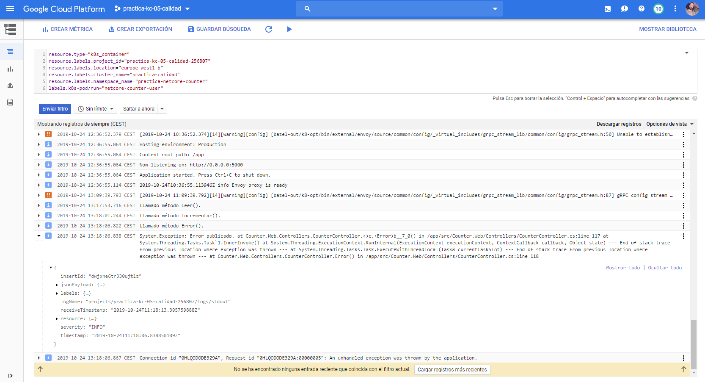

Se pueden observar las métricas con *[Grafana](https://grafana.com/)*, con el origen de datos de *[Prometheus](https://prometheus.io/)*, tras importar el [Dashboard](01-practica/monitoring/Dashboard_Peticiones_netcore-counter.json), en la siguiente dirección:

* [http://monitoring-grafana.35.195.3.143.nip.io/](http://monitoring-grafana.35.195.3.143.nip.io/):
  * Usuario: "admin".
  * Contraseña: "prom-operator".

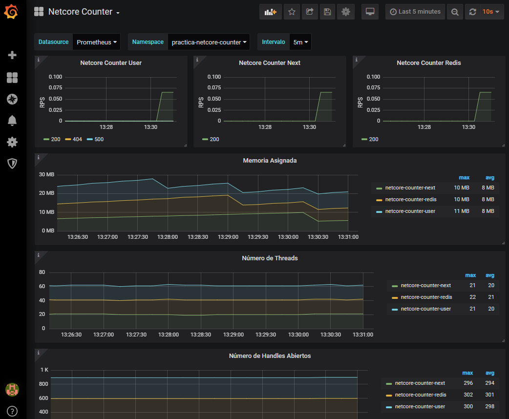

### Pruebas unitarias

La aplicación *netcore-counter* tiene un proyecto de *Test*, que contiene el fuente [CounterControllerTest](https://github.com/UREURE/netcore-counter/blob/master/solution/test/Counter.Web.Test/Controllers/CounterControllerTest.cs), con las pruebas unitarias del controlador [CounterController](https://github.com/UREURE/netcore-counter/blob/master/solution/src/Counter.Web/Controllers/CounterController.cs) de la solución.

En el [Dockerfile](https://github.com/UREURE/netcore-counter/blob/master/solution/Dockerfile) que genera las imágenes de la aplicación, está incorporada la ejecución de las pruebas unitarias de la solución.

### Mapa de Istio

Se puede generar con [Kiali](https://www.kiali.io/) en la siguiente dirección:

* [http://kiali.35.195.3.143.nip.io/](http://kiali.35.195.3.143.nip.io/).
  * Usuario: "admin".
  * Contraseña: "admin".

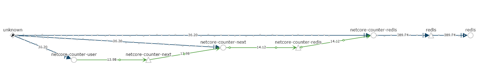

Mientras se activa y desactiva la *feature flag* de *netcore-counter*, se pueden observar los cambios de tráfico en el gráfico, utilizando [Locust](https://locust.io/), en la siguiente dirección:

* [http://locust.35.195.3.143.nip.io/](http://locust.35.195.3.143.nip.io/).

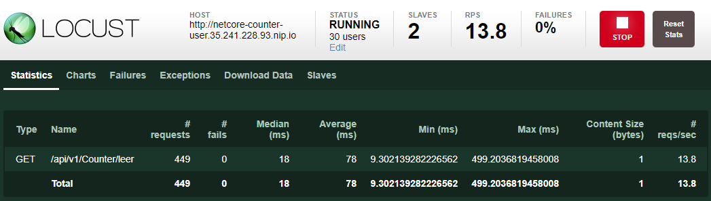

### Utilizar 5 buenas prácticas

#### 1. Resiliencia

En el fuente [Startup](https://github.com/UREURE/netcore-counter/blob/master/solution/src/Counter.Web/Startup.cs), se utiliza con [Polly](https://github.com/App-vNext/Polly) un *Circuit Breaker* de 30 segundos de duración, tras tres reintentos fallidos:

```C#
        public virtual void AddPolicies(IServiceCollection services)
        {
            services.AddSingleton<IReadOnlyPolicyRegistry<string>, PolicyRegistry>((serviceProvider) =>
            {
                PolicyRegistry registry = new PolicyRegistry();

                Action<Exception, TimeSpan> onBreak = (exception, timespan) =>
                {
                    serviceProvider.GetRequiredService<ILogger>().Error($"Utilizando CircuitBreaker durante {timespan.TotalSeconds} segundo(s) tras el error: {exception}");
                };
                Action onReset = () =>
                {
                    serviceProvider.GetRequiredService<ILogger>().Info($"Finalizando CircuitBreaker.");
                };
                AsyncCircuitBreakerPolicy breaker = Policy
                    .Handle<Exception>()
                    .CircuitBreakerAsync(2, TimeSpan.FromSeconds(30), onBreak, onReset);

                AsyncPolicy policyCache = Policy
                    .Handle<Exception>()
                    .RetryAsync(3, onRetry: (exception, retryCount) =>
                    {
                        serviceProvider.GetRequiredService<ILogger>().Warn($"Error en el intento {retryCount}: {exception}");
                    })
                    .WrapAsync(breaker);

                registry.Add(Claves.CLAVE_POLITICA_CACHE, policyCache);
                return registry;
            });
        }
```

La política es utilizada en los fuentes que implementan la interfaz [ICounterRepository](https://github.com/UREURE/netcore-counter/blob/master/solution/src/Counter.Web/Repository/ICounterRepository.cs) de acceso a datos.

* [CounterRedisRepository](https://github.com/UREURE/netcore-counter/blob/master/solution/src/Counter.Web/Repository/CounterRedisRepository.cs):

```C#
        public async Task<int> ObtenerContador()
        {
            string contador = await policy.ExecuteAsync(() => ObtenerContadorCache());
            return int.Parse(contador);
        }
```

* [NextCounterRepository](https://github.com/UREURE/netcore-counter/blob/master/solution/src/Counter.Web/Repository/NextCounterRepository.cs):

```C#
        public async Task<int> ObtenerContador()
        {
            string contador = await policy.ExecuteAsync(() => LeerContadorNextCounter());
            return int.Parse(contador);
        }
```

En el estado inicial, si se establece el número de réplicas del servicio "*netcore-counter-next*" a 0, las peticiones del servicio "*netcore-counter-user*" no podrán acceder al sistema de persistencia, porque tiene la *feature flag* con valor "**true**"; y, al tercer intento con error, se activará el "*Circuit Breaker*":

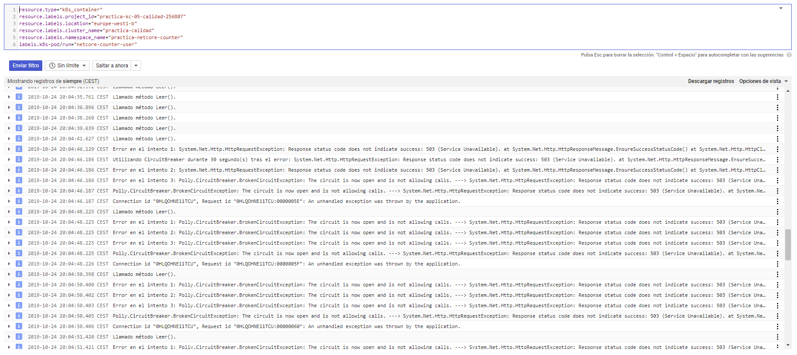

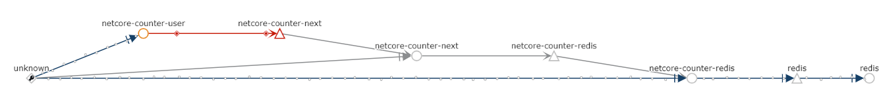

Cambiando la *feature flag* al valor "**false**" en el servicio "*netcore-counter-user*", consumirá directamente la base de datos Redis, cuando el pasen 30 segundos, y se desactive el "*Circuit Breaker*":

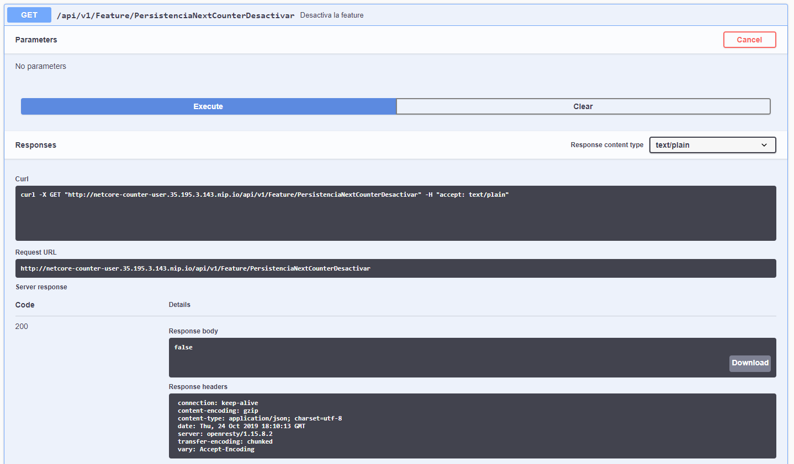

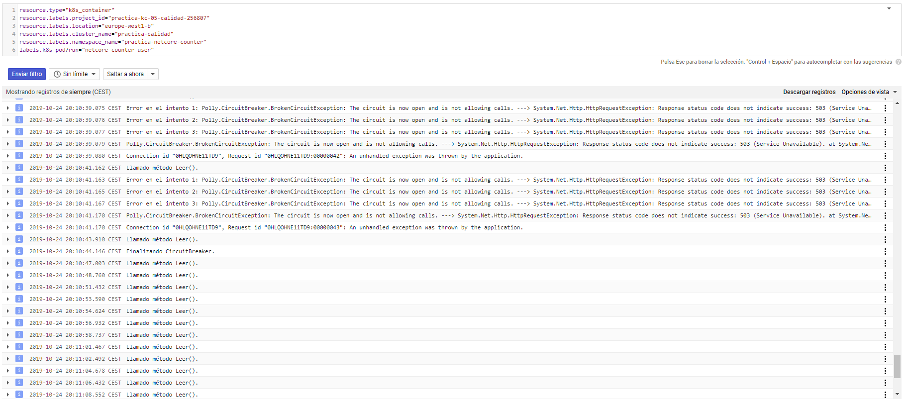

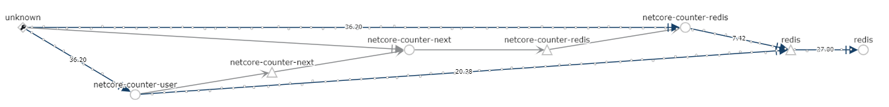

Si se establece el número de réplicas del servicio "*netcore-counter-next*" a 1, y se cambia la *feature flag* al valor "**true**" en el servicio "*netcore-counter-user*", la aplicación vuelve al estado original.

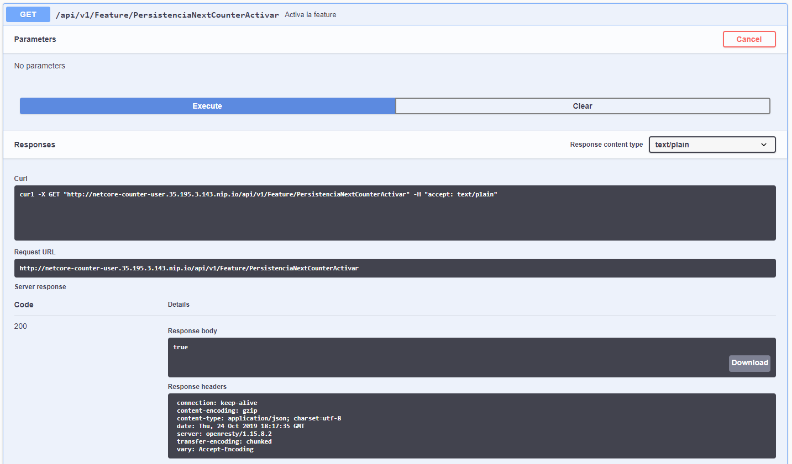

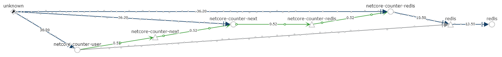

Con [Grafana](http://monitoring-grafana.35.195.3.143.nip.io/) se pueden observar las métricas de la aplicación durante la ejecución de la prueba:

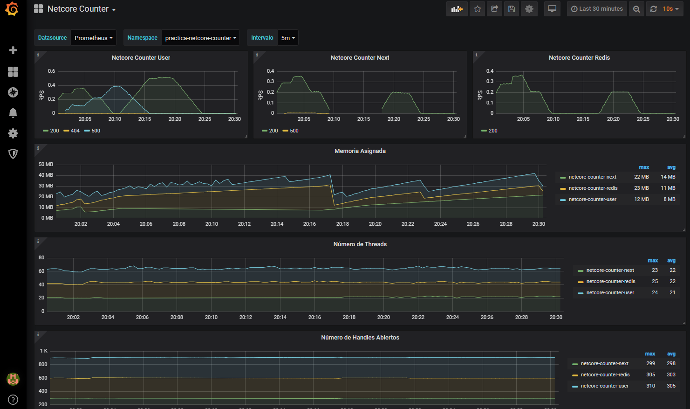

#### 2. Pruebas unitarias

Descritas en el punto [Pruebas Unitarias](#pruebas-unitarias).

#### 3. *Feature Flag* para habilitar o deshabilitar una funcionalidad

Descrita en el punto [Uso de *feature flags*](#uso-de-feature-flags), y ejecutada en el ejemplo de [resiliencia](#resiliencia).

#### 4. Observabilidad generando "*Logs*" e instrumentando la aplicación emitiendo métricas

Descrita en el punto [Emisión de *logs*, trazas y métricas](#emisión-de-logs-trazas-y-métricas), y mostrada en el ejemplo de [resiliencia](#resiliencia).

#### 5. *Health Checks*

El servicio expuesto de "*netcore-counter-user*" expone un *Health Check* en:

* [http://netcore-counter-user.35.195.3.143.nip.io/api/v1/Health/live](http://netcore-counter-user.35.195.3.143.nip.io/api/v1/Health/live).

Se ha vigilado la disponibilidad de la aplicación en *Stackdriver* utilizando: [*Uptime Check*](https://app.google.stackdriver.com/uptime/d194a25dad9c2151b4fb89501098df9e?project=practica-kc-05-calidad-256807).

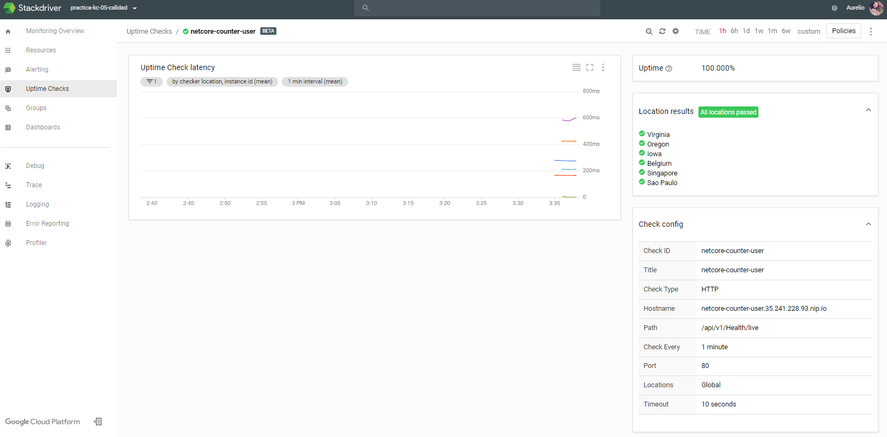
